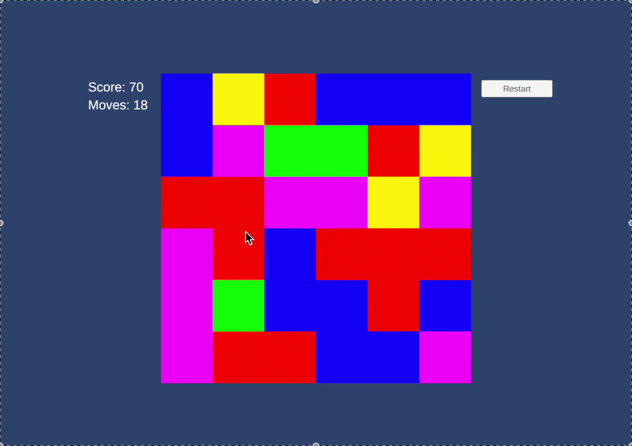
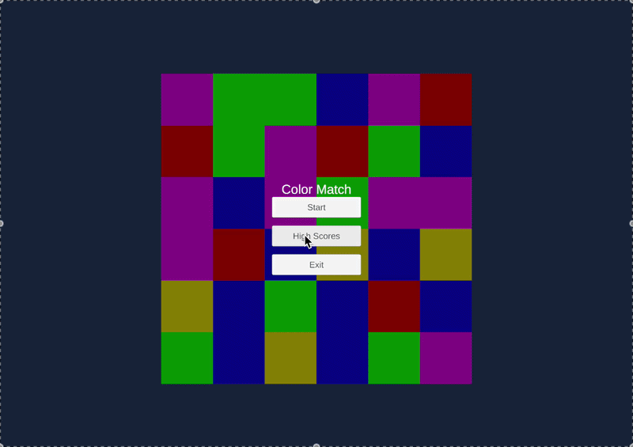
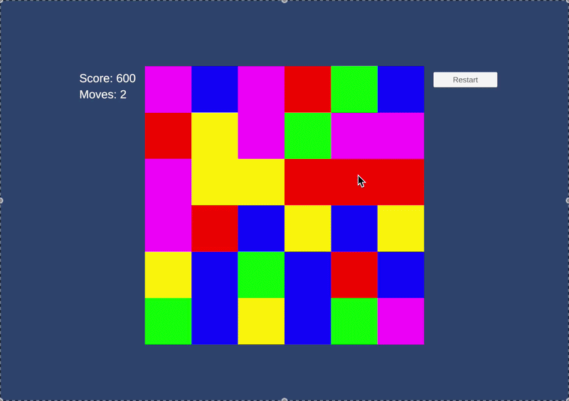

# PuzzleGrid

A colorful match-3 puzzle game built with Unity 6, featuring animated tile mechanics, progressive difficulty, and high score tracking.

## Overview

PuzzleGrid is a casual puzzle game where players match groups of connected tiles of the same color to earn points. The game combines strategic gameplay with smooth animations and a polished UI, making it accessible yet engaging.

## Features

- **Match-3 Gameplay**: Click on groups of connected tiles to clear them and earn points
- **Smooth Animations**: Tiles animate as they fall, clear with scaling/fading effects, and refill from the top
- **Progressive Difficulty**: Limited moves per game (20 moves standard) create strategic depth
- **High Score System**: Track your best scores with persistent leaderboard storage (top 5 scores)
- **Auto-Collapse & Refill**: Removed tiles automatically cascade down and new tiles spawn from the top
- **Responsive UI**: Dynamic HUD showing score and remaining moves, game over screen with name entry
- **Grid Recreation**: Easily generate new games with customizable grid dimensions

## Gameplay

### Core Mechanics


### UI & Menu System


### Game Over & High Scores



## Installation & Setup

### 1. Clone or Download

```bash
cd ~/PuzzleGrid
```

### 2. Open in Unity

1. Open Unity Hub
2. Select "Open" and navigate to the PuzzleGrid folder
3. Wait for Unity to import the project (first load may take several minutes)
4. Open the main scene from `Assets/Scenes/` (if multiple scenes exist, start with the first one)

### 3. Play in Editor

- Press **Play** in the Unity Editor
- Or build and run on your target platform

## How to Play

### Objective
Maximize your score before running out of moves.

### Gameplay
1. **Start Game**: Click "Start Game" from the main menu
2. **Match Tiles**: 
   - Click a tile to select a group of connected tiles of the same color
   - A minimum of 2 connected tiles can be cleared
   - More tiles = higher score multiplier
3. **Earn Points**: 
   - Each cleared tile = 10 points
   - Example: Clearing 5 tiles = 50 points
4. **Watch Tiles Fall**: Remaining tiles fall down to fill gaps
5. **Refill Grid**: New tiles spawn from above when needed
6. **Game Over**: Game ends when you run out of moves
7. **High Scores**: If you qualify (top 5), enter your name to save your score

## Project Structure

```
Assets/
├── Scripts/
│   ├── Core/
│   │   ├── GameManager.cs      # Game state & score tracking
│   │   └── ScoreManager.cs     # High score persistence
│   ├── Grid/
│   │   ├── GridManager.cs      # Grid generation & tile management
│   │   └── Tile.cs             # Individual tile behavior
│   └── UI/
│       ├── UIManager.cs        # UI state & panel management
│       ├── UIFollowWorldAnchor.cs  # Dynamic UI positioning
│       └── HighScoresUI.cs     # High score display
├── Prefabs/
│   ├── Tile.prefab             # Tile template
│   └── Row.prefab              # Optional row template
├── Materials/                   # Tile materials & shaders
├── Scenes/                      # Main game scenes
├── Settings/                    # Render & quality settings
└── Art/                         # Sprites & graphics
```

## Key Systems

### GridManager
Handles the core grid logic:
- Generates a configurable grid (default: 6x6)
- Manages tile spawning and positioning
- Detects connected groups using Breadth-First Search (BFS)
- Animates tile clearing, falling, and refilling
- Validates game moves and handles animations

**Key Functions:**
- `HandleTileClick(Tile tile)`: Process player click and clear matching group
- `GetConnectedGroup(Tile start)`: Find all connected tiles of same type
- `CollapseColumnsAnimated(float duration)`: Animate tiles falling down
- `RefillGridAnimated(float duration)`: Spawn and animate new tiles

### GameManager
Manages game state:
- Tracks current score and remaining moves
- Determines game over conditions
- Handles game start/reset
- Communicates with UI for updates

**Key Functions:**
- `StartNewGame(int startMoves)`: Initialize a new game session
- `AddScore(int amount)`: Award points to player
- `UseMove()`: Consume one move and check for game over

### ScoreManager
Persistent high score system:
- Saves top 5 scores using PlayerPrefs & JSON
- Validates if a score qualifies for the leaderboard
- Sanitizes player names (max 12 characters)
- Manages score submission and retrieval

**Key Functions:**
- `SubmitScore(string name, int score)`: Add score to leaderboard
- `LoadTopScores()`: Retrieve top 5 scores
- `WouldQualify(int score)`: Check if score makes the leaderboard

### UIManager
Controls all UI elements and panels:
- Manages menu, HUD, high scores, and game over screens
- Updates score and move display
- Handles scene navigation
- Coordinates with GameManager for state updates

**Key Panels:**
- Start Menu: Game intro and navigation
- HUD: Live score and moves remaining
- High Scores: Leaderboard display
- Game Over: Final score and name entry

### Tile
Individual tile behavior:
- Stores position (x, y) and type (color)
- Detects clicks via `OnMouseDown()` (using legacy input system)
- Updates visual color via SpriteRenderer

## Customization

### Grid Size
Edit GridManager in the Inspector:
- **Width**: Default 6 (number of columns)
- **Height**: Default 6 (number of rows)
- **Tile Size**: Default 1.0 (world units)

### Game Difficulty
Modify in GameManager:
- **Starting Moves**: Change `startMoves` parameter in `StartNewGame()`
- **Score Multiplier**: Edit the `* 10` in `AddScore()` calls

### Animation Timing
Adjust in GridManager:
- **Fall Duration**: Time for tiles to drop (default 0.30s)
- **Refill Duration**: Time for new tiles to spawn (default 0.35s)
- **Clear Duration**: Time for tiles to fade/scale out (default 0.15s)

### Colors
Modify tile colors in GridManager's `colors` array:
```csharp
private Color[] colors = {
    Color.red,
    Color.blue,
    Color.green,
    Color.yellow,
    Color.magenta
};
```

## Technical Details

### Flood Fill Algorithm
Connected tiles are detected using **Breadth-First Search (BFS)**:
- Starting from clicked tile, the algorithm explores all 4-directional neighbors
- Only includes tiles of the same type and within grid bounds
- Returns a list of all connected tiles for clearing

### Animation System
Smooth animations are handled via coroutines:
- Tiles animate scale & alpha when clearing (visual feedback)
- Falling tiles animate to target positions (gravity effect)
- New tiles animate from spawn height to final position
- All animations use `Time.deltaTime` for frame-independent timing

### Persistence
High scores are saved using:
- **PlayerPrefs**: Engine's built-in key-value storage
- **JSON Serialization**: Scores converted to JSON format for storage
- **Top 5 Filtering**: Only highest scores are retained

### Input Handling
- Currently uses legacy `OnMouseDown()` from MonoBehaviour
- Note: Future update planned to use the new Input System package

## Known Limitations

- Uses legacy mouse input system (`OnMouseDown()`); new Input System package is already imported for future migration
- High score system limited to top 5 scores (configurable in ScoreManager)
- No pause functionality currently implemented
- No sound or music system

## Future Enhancements

- [ ] Migrate to new Input System for better mobile support
- [ ] Add sound effects and background music
- [ ] Implement pause/resume functionality
- [ ] Add power-ups and special tiles (bombs, wildcards)
- [ ] Leaderboard with multiple difficulty levels
- [ ] Particle effects for tile clearing
- [ ] Mobile touch input with haptic feedback
- [ ] Difficulty progression with increasing grid size
- [ ] Daily challenges and bonus points
